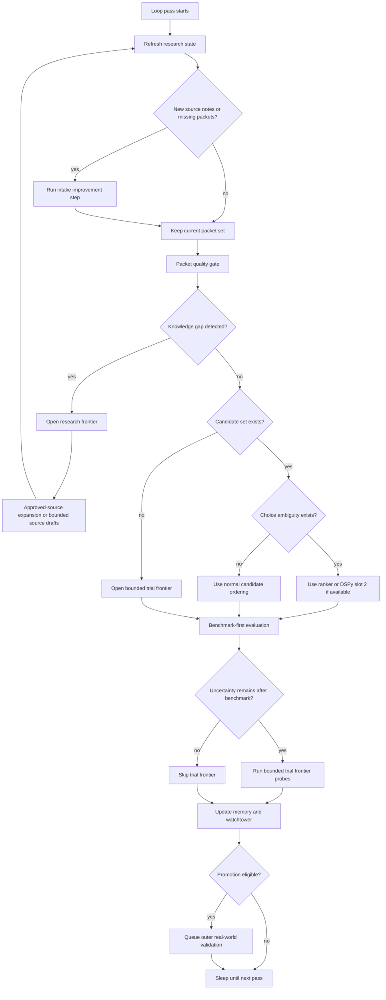

# Chip One-Loop Flywheel

Use this guide when a chip has moved beyond simple evaluation hooks and now needs a stronger learning loop.

This is the portable version of the richer startup-chip design.

The goal is:

- one governing loop
- several conditional stages
- no flat "run everything every pass" design

This pattern helps a chip combine:

- source learning
- packeting
- benchmarks
- bounded exploration
- memory
- outer validation
- optional DSPy help

## Core Rule

A mature chip should have one governing loop, not many disconnected loops.

That loop should decide what to do from state.

It should not run every subsystem on every pass just because those subsystems exist.

## Why This Matters

Without this pattern, chips drift into:

- research accumulation without testing
- benchmarks without source learning
- frontier mutation without knowledge growth
- DSPy side systems that do not affect the main loop cleanly
- watchtower pages that describe parts of the system but not the flywheel

## The Generic Flywheel

## Always-On Stages

These should run every pass:

1. research refresh
2. packet quality gate
3. memory update
4. watchtower update

These are the minimum stable heartbeat of a serious chip loop.

## Conditional Stages

These should run only when the chip state justifies them.

### Intake Improvement

Run when:

- new source notes exist
- packet coverage is missing
- packet extraction quality needs recalibration

This is where packet-extractor DSPy usually belongs if a chip has it.

### Research Frontier

Run when the chip has a knowledge gap, not just a trial gap.

Examples:

- repeated failure shapes are underexplained by current packet coverage
- important source areas are thin
- a benchmark boundary is clear but the mechanism behind it is not well covered by research

Outputs:

- approved-source queue items
- bounded source-note drafts
- new packet opportunities

It should not emit doctrine directly.

### Benchmark Path

Run when:

- packet-derived doctrine can be expressed as benchmark-compatible candidates
- or promoted doctrine needs stronger grounding

This is the chip's main inner truth surface when a benchmark exists.

### Trial Frontier

Run when:

- benchmark leaves uncertainty
- boundaries need pressure-testing
- or no clean benchmark move exists yet

This lane is exploratory and must remain bounded.

### Outer Real-World Validation

Run only when:

- doctrine is promoted and benchmark-grounded by default
- or a human explicitly escalates strategically important research-grounded doctrine

This lane should be slower and more selective than the inner loop.

## The Two Frontier Types

Every richer chip should explicitly separate frontier into:

- `research_frontier`
- `trial_frontier`

This is one of the most important lessons from the startup chip.

If a chip uses trial frontier to compensate for research ignorance, the loop gets noisy.

If a chip uses research frontier when it really needs boundary testing, the loop gets slow and evasive.

So the chip must ask:

- do we need more knowledge?
- or do we need more testing?

## DSPy Placement

DSPy should help narrow loop stages, not become the loop.

Best placements:

- slot 1: source or near-source note -> structured packet
- slot 2: candidate set + context -> best next probe

DSPy should be conditional:

- slot 1 only when new intake work exists
- slot 2 only when ranking a real choice set matters

## Benchmark Bridge

If a chip has a benchmark lane, connect it to chip promotion using a small bridge artifact or equivalent bridge semantics.

Use:

- `docs/CHIP_BENCHMARK_BRIDGE_GUIDE.md`

Do not let:

- benchmark reports act as doctrine
- or chip memory act as benchmark truth

## Evidence Lanes

At minimum, keep these distinct:

- `research_grounded`
- `benchmark_grounded`
- `exploratory_frontier`
- `realworld_validated`

The system gets worse when these lanes share one verdict surface.

## Promotion Rule

Promotion should follow this pattern:

1. source learning
2. packeting
3. benchmark grounding
4. doctrine or boundary candidate
5. outer real-world validation

Do not skip from research residue to durable doctrine.

## What Transfers Across Chips

Portable:

- one governing loop
- research frontier vs trial frontier
- benchmark bridge
- memory and watchtower update as always-on stages
- conditional DSPy slots
- outer validation gating

Domain-specific:

- source families
- packet vocabulary
- benchmark tasks
- contradiction tags
- outer real-world tasks

## Acceptance Check

A chip is using the one-loop flywheel well only if:

1. it has one governing loop, not disconnected research / benchmark / DSPy loops
2. it can tell the difference between a knowledge gap and a trial gap
3. it separates research frontier from trial frontier
4. DSPy is conditional and narrow
5. benchmark grounding is not the only lane, but it is still the main inner truth surface when present
6. stronger doctrine has a path into outer real-world validation

## Related Docs

- `docs/CHIP_INTELLIGENCE_CONTRACT.md`
- `docs/CHIP_INTELLIGENCE_ROLLOUT.md`
- `docs/CHIP_DSPY_METHOD.md`
- `docs/CHIP_BENCHMARK_BRIDGE_GUIDE.md`
- `docs/CHIP_RESEARCH_PACKET_SCHEMA.md`
